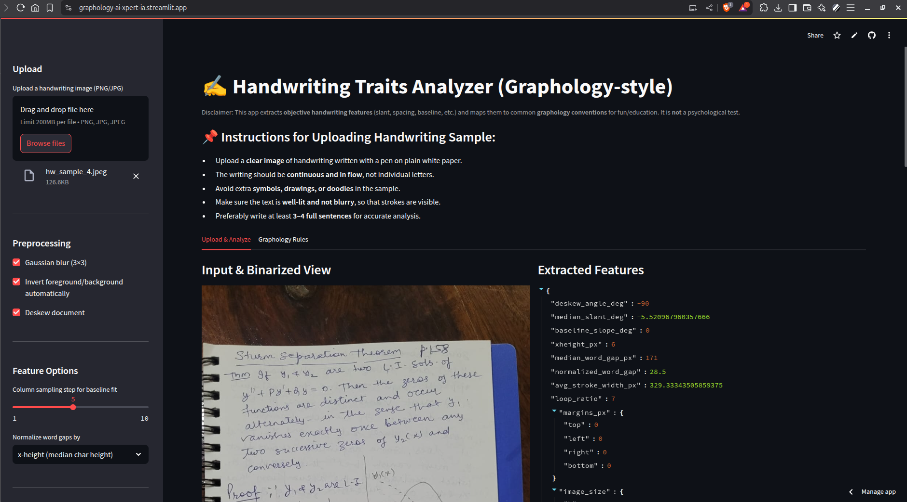
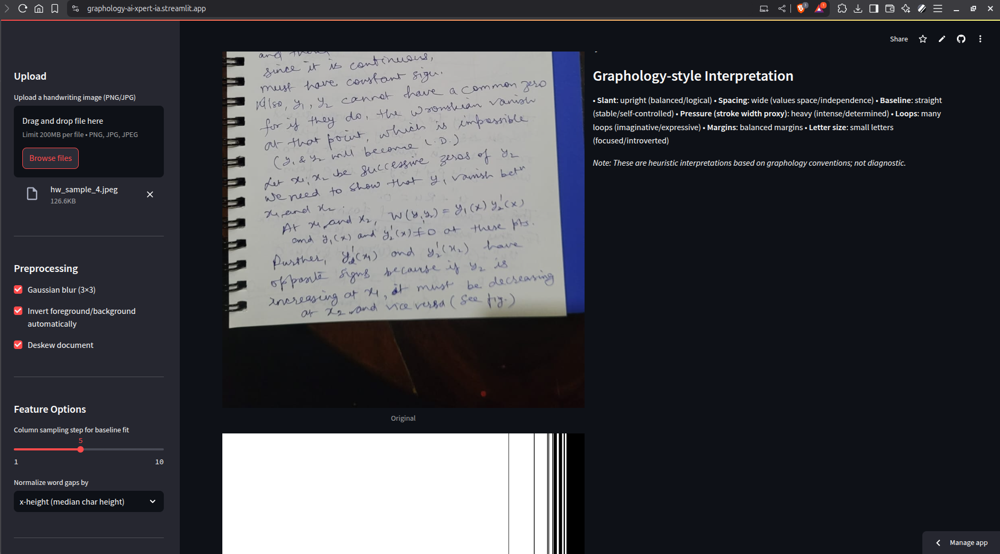
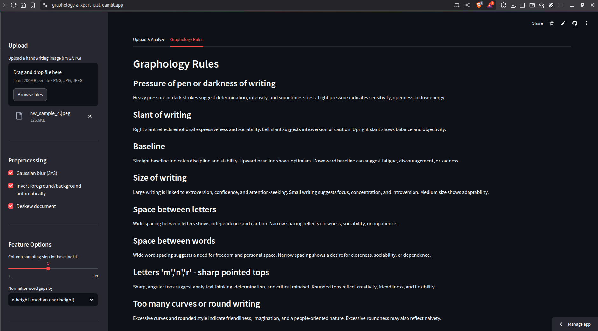

# Handwriting Analyzer (Graphology)
Graphology is the study of handwriting, especially when regarded as an expression of a person's character or psychological state. While not a fully scientific method, research suggests that some handwriting traits **can reflect personality to some extent** — so it’s not complete nonsense either. 😉

---

## 🌟 Project Overview
This project is a **Streamlit-based web app** that:
- Takes a handwriting image as input  
- Extracts objective features (slant, baseline, margins, spacing, loops, stroke width, etc.)  
- Maps those features to **graphology-inspired interpretations**  
- Displays results interactively along with feature values  
- Allows downloading results in JSON format  

---

## Features
- Binarization, optional deskew
- Component analysis (x-height, slant via PCA)
- Baseline slope (linear regression on lower envelope)
- Word spacing (median gap), normalized by x-height or image width
- Stroke width proxy via distance transform
- Loop ratio using contour hierarchy
- Margin measurements
- JSON export of all features + interpretation
- Interactive UI

---

## 📸 Input Requirements
For best results, please upload a handwriting sample that is:
- Written in **continuous flow** (not random words/symbols)  
- On a **plain white background** (no noisy patterns)  
- Without extra drawings or special characters  
- Clearly visible (not too faint or blurred)  

---

## ⚙️ Tech Stack
- **Python** 🐍  
- **OpenCV** – Image processing  
- **NumPy** – Computation  
- **Streamlit** – Web app framework  
- **Graphology-inspired heuristics** – For interpretation  

--- 

## Project Structure
```
Graphology_AI_Expert/
├── app.py
├── utils/
│   ├── image_processing.py
│   └── graphology.py
├── requirements.txt
└── README.md
```

## Setup & Run

```bash
# 1) Clone the repository  
git clone https://github.com/your-username/handwriting-graphology.git
cd handwriting-graphology

# 2) Create venv (recommended)
python -m venv .venv
source .venv/bin/activate  # Windows: .venv\Scripts\activate

# 3) Install dependencies
pip install -r requirements.txt

# 4) Run the app
streamlit run app.py
```

### Graphology AI Expert Working Demo
[Website](https://graphology-ai-expert-ia.streamlit.app/)
<br><br>




## Notes
- The "pressure" metric uses **average stroke width** as a proxy, which depends on image resolution. Try to upload similar DPI scans for fair comparisons.
- Thresholds are heuristic; you can tweak them in `utils/graphology.py`.
- This app doesn’t perform OCR; it focuses on visual traits rather than text content.

## ⚠️ Disclaimer
This project is for educational and exploratory purposes only. Graphology is not a fully scientific tool for personality analysis, but it can reveal interesting insights in some cases. Use results for fun and exploration, not as absolute truth.

## 💡 Future Improvements
- Add more graphology rules
- Support cursive/script recognition
- Provide statistical confidence scores
- Multi-language support

## 🤝 Contributing
Contributions are welcome! Feel free to fork, raise issues, and submit PRs.

### Developed with ❤️
